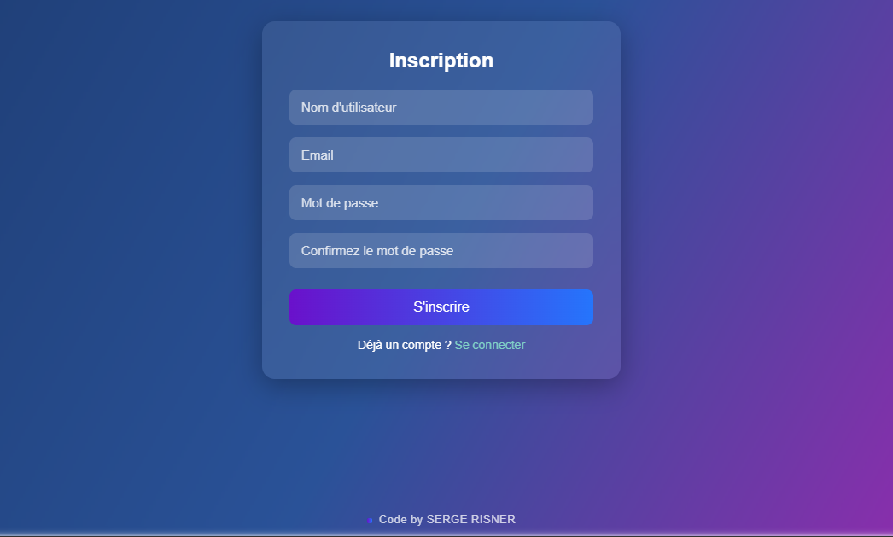

# Login Page — Gradient color GlassMorphism

Voici une capture d'écran du projet :

Visualisation en ligne (si GitHub Pages est activé pour ce repo) :

https://sergecloud10-code.github.io/Login-Page-Gradient-color-GlassMorphism/

Instructions rapides :
- Pour que l'image s'affiche dans ce README, placez la capture dans `assets/screenshot.png` au même niveau que ce README.
- Pour activer la page de démo via GitHub Pages :
  1. Allez dans les paramètres (Settings) du repo sur GitHub.
  2. Dans la section "Pages", sélectionnez la branche `main` et le dossier `/ (root)`.
  3. Enregistrez — la page devrait être disponible à l'URL fournie ci-dessus après quelques minutes.

Si vous voulez, je peux aussi :
- Ajouter l'image `assets/screenshot.png` ici-même et la committer pour vous (je peux le faire si vous confirmez),
- Ou activer/configurer GitHub Pages automatiquement (j'ajoute les fichiers nécessaires si besoin).

---

Code by SERGE RISNER
